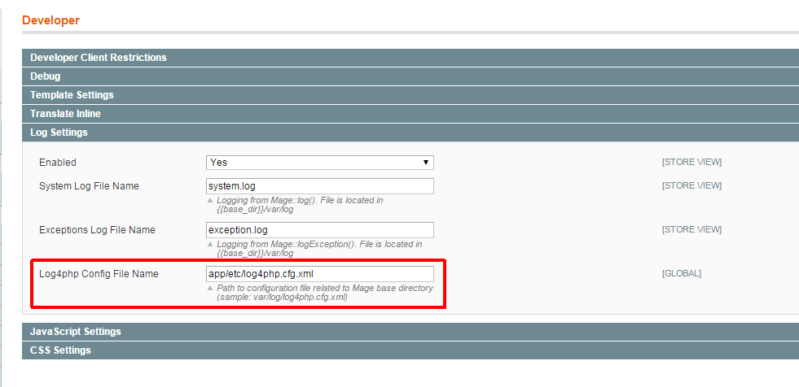

# Log4php wrapper to use Log4php with Magento

## Installation

    {
      "require": {
        "praxigento/mage_ext_log4php": "*"
      },
      "repositories": [
        {
          "type": "vcs",
          "url": "https://github.com/praxigento/mage_ext_log4php"
        }
      ]
    }

## Configuration
Go to System / Configuration / Developer / Log Settings and setup path to 
[Log4php](https://logging.apache.org/log4php/quickstart.html) configuration file relative to the Magento root folder:

 

## Usage

### Simple usage

Usage in case of your own module has dependency to Praxigento_Log:

    $log       = Praxigento_Log_Logger::getLogger(__CLASS__);
    $log->trace("trace level message");
    $log->debug("debug level message");
    $log->info("info level message");
    $log->warn("warn level message");
    $log->error("error level message");
    $log->fatal("fatal level message");

### Create adapter in your own module

Use adapter to automatically switch between Praxigento_Log wrapper (if installed) and Magento default logs (otherwise):

    <?php
    class Namespace_Module_Logger
    {
        /** @var bool 'true' - Log4php logging framework is used. */
        private static $_isLog4phpUsed = null;
        /** @var Praxigento_Log_Logger */
        private $_loggerLog4php;
        /** @var string name for the current logger */
        private $_name;
    
        function __construct($name)
        {
            /**
             * switch off/on error reporting to prevent messages like
             * "ERR (3): Warning: include(Praxigento\Log\Logger.php): failed to open stream: No such file or directory"
             * in case of Praxigento_Log module is not used. 
            */
            $level = error_reporting(0);
            self::$_isLog4phpUsed = class_exists('Praxigento_Log_Logger', true);
            error_reporting($level);
            if (self::$_isLog4phpUsed) {
                $this->_loggerLog4php = Praxigento_Log_Logger::getLogger($name);
            } else {
                $this->_name = is_object($name) ? get_class($name) : (string)$name;
            }
        }
    
        /**
         * Override getter to use '$log = Praxigento_Log_Logger::getLogger($this)' form in Mage classes.
         * @static
         *
         * @param string $name
         *
         * @return Namespace_Module_Logger
         */
        public static function getLogger($name)
        {
            $class = __CLASS__;
            return new $class($name);
        }
    
        public function debug($message, $throwable = null)
        {
            $this->doLog($message, $throwable, 'debug', Zend_Log::INFO);
        }
    
        public function error($message, $throwable = null)
        {
            $this->doLog($message, $throwable, 'error', Zend_Log::ERR);
        }
    
        public function fatal($message, $throwable = null)
        {
            $this->doLog($message, $throwable, 'fatal', Zend_Log::CRIT);
        }
    
        public function info($message, $throwable = null)
        {
            $this->doLog($message, $throwable, 'info', Zend_Log::NOTICE);
        }
    
        public function trace($message, $throwable = null)
        {
            $this->doLog($message, $throwable, 'trace', Zend_Log::DEBUG);
        }
    
        public function warn($message, $throwable = null)
        {
            $this->doLog($message, $throwable, 'warn', Zend_Log::WARN);
        }
    
        /**
         * Internal dispatcher for the called log method.
         * @param $message
         * @param $throwable
         * @param $log4phpMethod
         * @param $zendLevel
         */
        private function doLog($message, $throwable, $log4phpMethod, $zendLevel)
        {
            if (self::$_isLog4phpUsed) {
                $this->_loggerLog4php->$log4phpMethod($message, $throwable);
            } else {
                Mage::log($this->_name . ': ' . $message, $zendLevel);
                if ($throwable instanceof Exception) {
                    Mage::logException($throwable);
                }
            }
        }
    }

Use your own adapter to log messages:

    $log       = Namespace_Module_Logger::getLogger(__CLASS__);
    $log->trace("Log your message with Log4php (in case of Praxigento_Log extension is installed) or with Magento log (otherwise)");
    $log->debug("debug level message");
    $log->info("info level message");
    $log->warn("warn level message");
    $log->error("error level message");
    $log->fatal("fatal level message");
